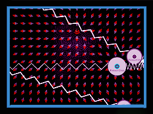

# 07Coccinelle

## Description
07Coccinelle is an educational 2D game created in Java using the Swing framework. 
This project served as our final assignment for our college degree in 2017. 
The game features 5 levels where players can interact with various physical theorems, including:
- Magnetic fields
- Springs
- Ball collisions
- Light reflection
- Cyclotron (particle accelerator)

Additionally, the game includes a level editor that allows users to create their own levels using these physical theorems.

## How to run the project
Unfortunately, this project has not been run since 2015 on Eclipse, so there is no guarantee that it is still functional.
The only reason this was made available is because I stumbled upon that source code on my computer and thought it would be interesting to share. 
It has also helped me reflect on my programming journey.

## Authors
This project was developed by:
- Kevin Takla (myself)
- Zi Zheng Wang

## Disclaimer
Most of the source code is in french.
